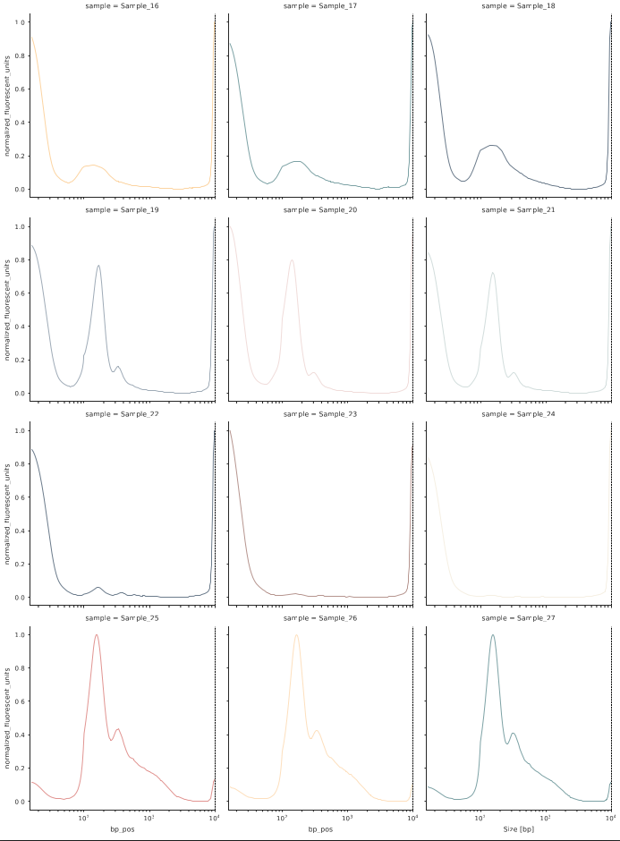
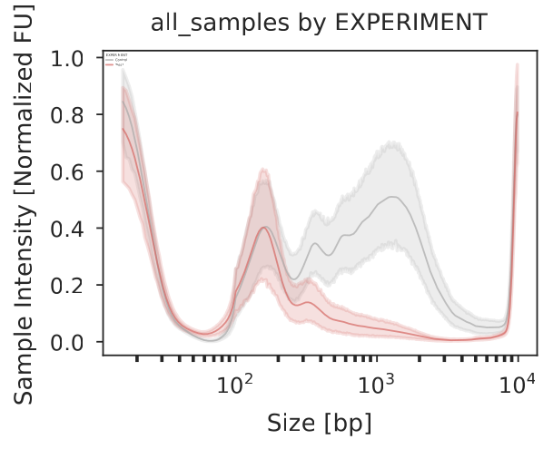

DNAvi: a python tool for integration, analysis, and visualization of cell-free DNA fragments in liquid biopsies
===========

Author: Anja Hess

Date: 2025-JUL-22

Affiliations: 
1. Max Planck Institute for Molecular Genetics, Berlin, Germany
2. Exploratory Diagnostic Sciences, Berlin Institute of Health at Charité Universitätsmedizin Berlin, Berlin, Germany 
3. Digital Health Cluster, Hasso Plattner Institute for Digital Engineering, Digital Engineering Faculty, University of Potsdam, Potsdam, Germany
4. Department of Biology, Chemistry and Pharmacy, Freie Universität Berlin, Berlin, Germany

## 1. Description
DNAvi is an open-access software to integrate, analyze and visualize multiple DNA fragmentation profiles from automated gel electrophoresis 
devices. The tool was tested on a 32 GB memory local PC on Ubuntu 24.04.2 LTS.

## 2. Installation

Please make sure you have installed **python => 3.12**. Next, download the required packages:

Python packages:

    pip install argparse numpy pandas seaborn scipy matplotlib imageio scikit-image werkzeug scikit_posthocs

Conda:

    conda create --name dnavi argparse numpy pandas seaborn scipy matplotlib imageio werkzeug scikit-image scikit_posthocs
    conda activate dnavi

Next, download the repository.

Through *github CLI*:
    
    gh repo clone anjahess/DNAvi_light

Or through *wget*:

    wget https://github.com/anjahess/DNAvi_light/archive/refs/heads/main.zip

Unpack or move the DNAvi folder to your location of choice and you're ready to start.

## 3. Quick start

### 3.1 Open the termial

Linux: **Ctrl+Alt+T** \
MAC: **Launchpad -> Search Terminal -> Click on Terminal** \
Windows: **Windows Symbol -> search cmd.exe -> Click cmd.exe** 

### 3.2 Run DNAvi

In this example we will run DNAvi on a test electropherogram signal table provided in this package:

    python3 DNAvi.py -i electropherogram.csv -l ladder.csv -m meta.csv

If you need help, simply run

    python3 DNAvi.py --help

Which will result in a display of command line arguments with additional explanaitons:

    Welcome to
      ____  _   _    _        _
     |  _ |  \ | |  / \__   _(_)
     | | | |  \| | / _ \ \ / / |
     | |_| | |\  |/ ___ \ V /| |
     |____/|_| \_/_/   \_\_/ |_| 
     
    usage: DNAvi.py [-h] [-i [<input-file-or-folder>]] -l [<ladder-file>]
                    [-m [<metadata-file>]] [-n [<run-name>]] [-incl] [--verbose]
    
    Analyse Electropherogram data e.g. for cell-free DNA from liquid biopsies
    
    options:
      -h, --help            show this help message and exit
      -i [<input-file-or-folder>], --input [<input-file-or-folder>]
                            Path to electropherogram table file or image file OR
                            directory containing those files. Accepted formats:
                            .csv/.png/.jpeg/.jpg or directory containing those.
      -l [<ladder-file>], --ladder [<ladder-file>]
                            Path to ladder table file. Accepted format: .csv
      -m [<metadata-file>], --meta [<metadata-file>]
                            Path to metadata table file containing grouping
                            information for input file (e.g. age, sex, disease).
                            Accepted format: .csv
      -n [<run-name>], --name [<run-name>]
                            Name of your run/experiment. Will define output folder
                            name
      -incl, --include      Include marker bands into analysis and plotting.
      --verbose             increase output verbosity
    
    Version: 0.1, created by Anja Hess <anja.hess@mail.de>, Max Planck Institute
    for Molecular Genetics, Berlin, GERMANY

## 4. Example

In this example we will run DNAvi on a test electropherogram signal table provided in this package:

    cd DNAvi/
    python3 DNAvi.py -i tests/electropherogram.csv -l tests/ladder.csv -m tests/metadata.csv

This will result in the following output:
    
    Welcome to
      ____  _   _    _        _
     |  _ |  \ | |  / \__   _(_)
     | | | |  \| | / _ \ \ / / |
     | |_| | |\  |/ ___ \ V /| |
     |____/|_| \_/_/   \_\_/ |_| 
      
        DNA file: tests/electropherogram.csv      
        Ladder file: tests/ladder.csv
        Meta file: tests/metadata.csv

    ------------------------------------------------------------
               ELECTROPHEROGRAM DNA SIZE ANALYSIS
    ------------------------------------------------------------
         
            DNA file: tests/electropherogram.csv      
            Ladder file: tests/ladder.csv
            Meta file: None
    
    Saving results to: tests/results/
    
    ------------------------------------------------------------

... and additional infos depending on the verbosty level. Once DNAvi is finished,
this message will appear:

You can now go to you results folder:
    
       ├── results
            ├── plots
            │   ├── all_samples_nomarker_summary.pdf
            │   ├── all_samples.pdf
            │   ├── basic_statistics.csv
            │   ├── group_statistics.csv
            │   ├── peak_statistics.csv
            │   └── sourcedata.csv
            └── qc
                ├── 0_custom_interpolated.pdf
                ├── bp_translation.csv
                ├── info.csv
                ├── interpolated.csv
                ├── peaks_0_custom.pdf
                └── peaks_all_interpolated.pdf

In the plots folder, you will find various plots summarizing fragmentomic traces of your samples.

In case you provided a metadata file, each category will result in its own plot. In the example below, the 27 samples stem from
two experiments, and we can see the integrated profile plot for each expeirment below:

## 5. Multi-file input

If you have multiple gel images or csv files to process, just put them into a folder and point DNAvi to that folder: \
**! Attention:** Run together only files that have the **same DNA ladder**.

    python3 DNAvi.py -i /path/to/folder -l ladder.csv

## 6. Citation

Anja Hess, Alexander Meissner, Dominik Seelow, and Helene Kretzmer: 
**DNAvi: a python tool for integration, analysis, and visualization of cell-free DNA fragments in liquid biopsies (2025)**
