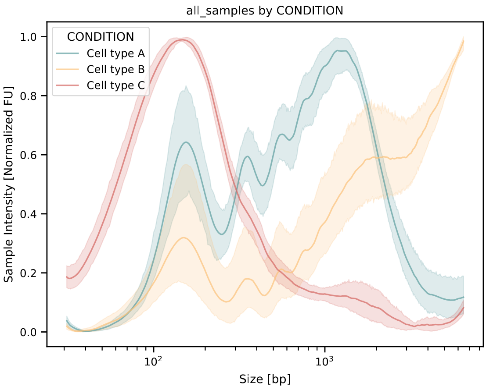
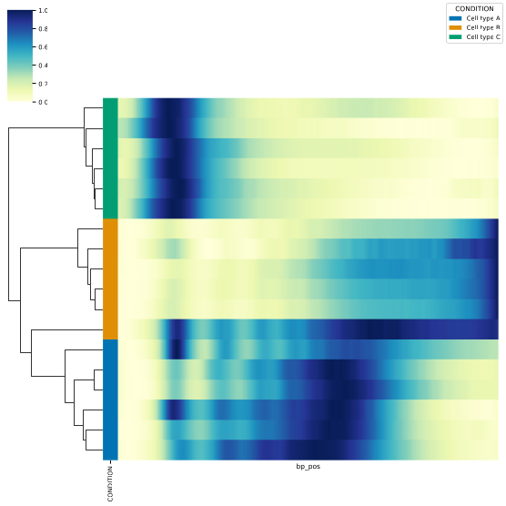
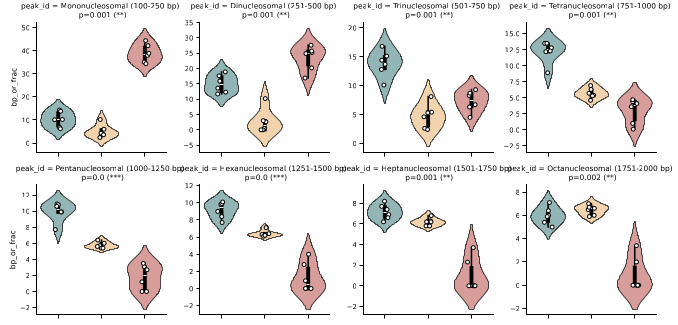
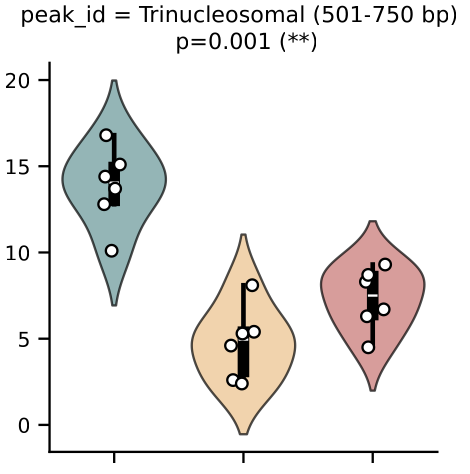
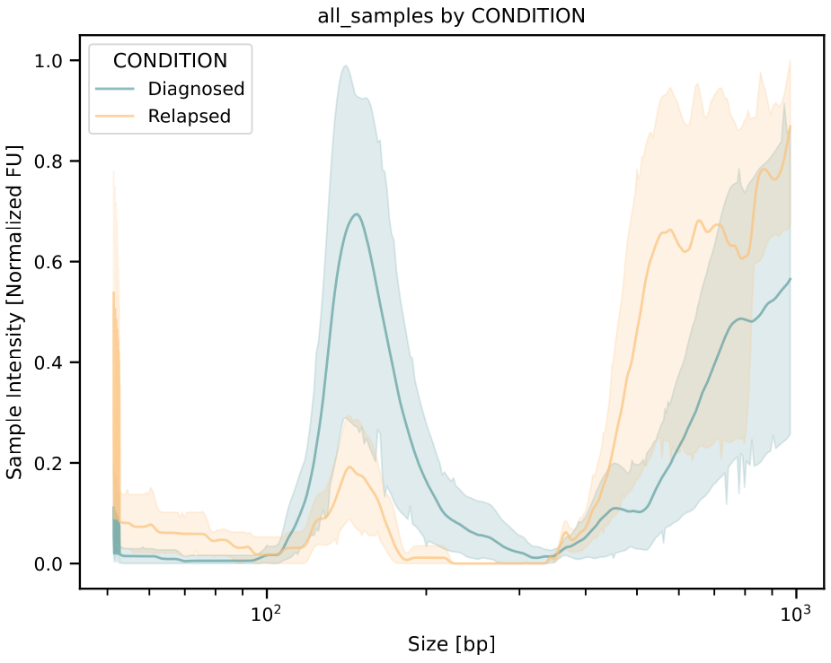
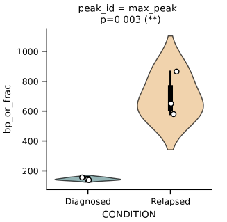
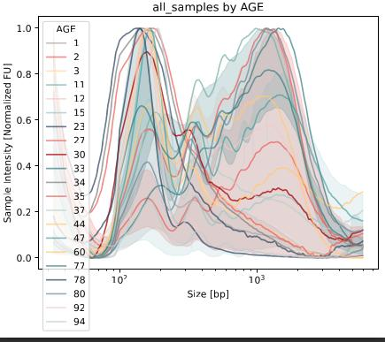

Biological Interpretation
===================

This section provides examples on how to use DNAvi's statistical analyses and outputs to answer biological questions.

*Disclaimer: While representing real cell-free DNA profiles, the examples below solely serve the purpose of technical demonstration of software
usability. No real-world conclusions are derived.*

Example 1: Cell-free DNA in cells
^^^^^^^^^^^^^^^^^^

    • **Example: cfDNA from cell types A, B, C**
    • **N = 6 per group**

To quickly answer this question, we can consider the **line plot** (in **/plots**) for an overview:

Next, we will look at the **clustermap plot** (also in **/plots**) for euclidian distance-based hierarchical clustering.

The **color bar** on the left indicates the **cell type group** each sample belongs to.

**Result:** In this example, the clustering reveals sorting of global fragmentation patterns largely matching the condition, indicating that the is indeed a global change in cell-free DNA fragmentation
between the groups.

Question: Which nucleosomal fractions are different between the groups?
-----------

The DNAvi analysis provides peak metrics for each sample:
    • **average_size** : the average fragment size, estimated from the signal table (histogram)
    • **max_peak**: the most intense peak (peak with highest fluorescent signal) of this sample
    • **peak_id**: the detected peaks (0-based) and their sizes for each sample
    • **nucleosomal fractions**: the fraction of cell-free DNA falling into a nucleosomal size range for each sample

To immediately check which nucleosomal fractions are different, let's check the visual output in the **/stats** folder:

... (showing first 8 plots only)

From these plots we can immediately see differences in the sizes of individual nucleosomal fractions:

    • **Mononucleosomal (100-250 bp)**
    • **Dinucleosomal (251-500 bp)**
    • **Trinucleosomal (501-750 bp)**
    • **...**

**Result:** In this example, **Cell Type C** has a much higher fraction of mono- and di-nucleosomal DNA,
whereas **Cell Type A** has relatively more trinucleosomal cell-free DNA.

Question: Is this difference statistically significant?
-----------

We can check the results of the **Kruskal-Wallis Test**, reported in **/stats/group_statistics** file:

.. csv-table:: Example of a DNAvi group statistics file
   :file: _static/biology_posthoc.csv
   :widths: 20, 20, 20, 20
   :header-rows: 1

**Hint:** For convenience, this is already reported in the plots above, see enlarged part here (reporting significant p-values with star symbols):

**Result:** Based on the **Kruskal-Wallis Test**, cell-free DNA from 3 groups (Cell type A, B, and C) shows a significant difference in
certain nucleosomal fractions, here at the example of the trinucleosomal fraction, meaning at least one group is statistically different from the others.

Question: Which groups differ?
-----------

To check the group-to-group comparisons, we consult the **group_statistics** file in the **/stats** folder.

In the detailed **posthoc p-value** column, we see the group-wise comparisons:

.. csv-table:: p-values for group-wise comparisons in Conover's posthoc test
   :file: _static/biology_posthoc_zoom.csv
   :widths: 30, 30, 30, 30
   :header-rows: 1

**Result:** Based on the **Posthoc Conover's Test with Bonferroni correction**, cell-free DNA in the
**Cell type A** has a significantly higher trinucleosomal cfDNA fraction than **Cell type B and C**.
Cell type B and C however do not reach statistical significance here, so we cannot say their trinucleosomal fractions differ.

Biological Interpretation
-----------

Taking into account these statistical tests, we can conclude that the three cell types here show different cell-free DNA fragmentation profiles.
Based on hierarchical clustering, Cell type A and B seem more closely related, potentially indicating that the clustering is dominated by differences in larger fragments (e.g. pentanucleosomal and higher).
Zooming into the individual nucleosomal fractions allowes us however to see more fine-grained differences.
One example is that we have identified a significant enrichment in trinucleosomal cfDNA for Cell Type A, that is different from Cell Type B and C.
Together, we have demonstrated that each cell type in this study displayed a unique cell-free DNA profile.

Example 2: Cell-free DNA in cancer patients
^^^^^^^^^^^^^^^^^^

To cover a clinical example, we analyse the data by **Trinidad et al. (2023)**:

    • **Example: cfDNA from cancer patients (diagnosed & relapsed)**
    • **N = 4 per group**

.. code-block::

    Trinidad EM, Juan-Ribelles A, Pisano G, et al. Evaluation of circulating tumor DNA by electropherogram analysis and methylome profiling in high-risk neuroblastomas. Front Oncol 2023;13. [DOI: 10.3389/fonc.2023.1037342])

They compare liquid biopsy fragmentation profiles at diagnose and at relapse,
and we can use this information for metadata and group-wise comparisons.
Here's the results from DNAvi:

    • **Line plot**

Hierarchical clustering will be evaluated, revealing largely clustering by condition:

    • **Cluster map**

.. image:: _static/biology-trinidad.png
  :width: 300
  :alt: Trinidad

Question: Whats the average size of the maximum DNA intensity peak here?
------

Let's check **/stats/group_statistics.csv**

    • Diagnosed: 155 bp
    • Relapsed: 650 bp

Is this difference statistically significant?
-------

For convenience we can check the **Kruskal Wallis p-value** in the plots saved to **/stats**

**Result:** If we stratify the cell-free DNA samples by patient status (diagnosed vs. relapsed),
we detected a significant difference in the maximum cell-free DNA peak.

Biological Interpretation
-----------

In this clinical example dataset we would conclude that the disease status of the cancer patients
has a statistically significant effect of cfDNA fragment profiles.
Specifically, cell-free DNA from relapsed patients had a significantly larger maximum DNA peak compared to
diagnosed patients.

Example 3: Negative results
^^^^^^^^^^^^^^^^^^

To quickly also cover the characteristics of 'negative results', here's an example where cell-free DNA profiles were
stratified by age.

    • **Example: 21 cfDNA samples (each assigned a different age)**
    • **N = 1 per group**

.. csv-table:: Example of group statistics output II
   :file: _static/group_statistics_by_AGE.csv
   :widths: 30, 30, 30, 30, 30, 30, 30
   :header-rows: 1

**Result:** If we stratify the cell-free DNA samples by age, no significant difference is found (all p values are > 0.05). This
may be because our sample size is too small or because we have not pooled by age groups.

Biological Interpretation
-----------

In this example dataset we would interpret that age does not have a statistically significant effect of cfDNA
fragment profiles.

*Disclaimer: Please keep in mind that adding more metadata may require more stringent statistics due to multiple testing.
Note that while representing real cell-free DNA profiles, the examples below solely serve the purpose of technical demonstration of software
usability. Research context only. No real-world conclusions can be derived from this example.*