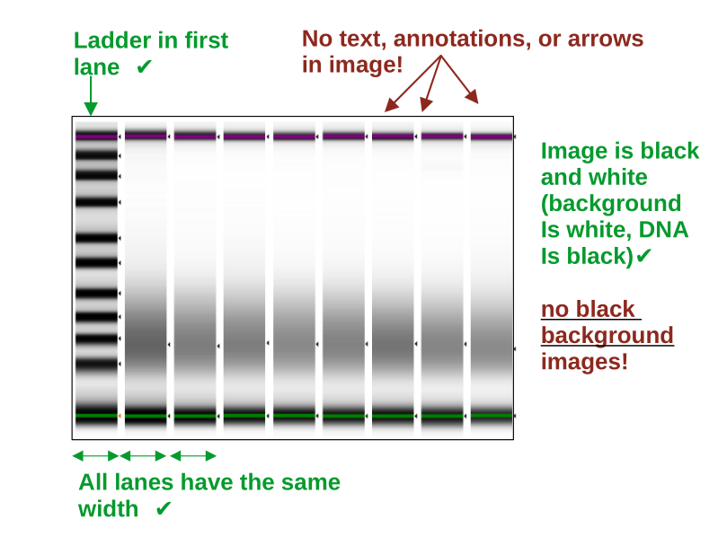

Inputs
===================

1. DNA signal tables
^^^^^^^^^^^^^^^^^^

Tables have to be tab-separated in .csv / .tsv / .txt format and fulfill all criteria below:

    • Columns are tab-separated
    • The first row is the header
    • The first column is always named “Ladder”
    • Sample names in header (not allowed: “,;’’!.” or white space)
    • Sample names must match metafile sample names (if provided)
    • All column values are numeric (and refer to DNA band intensity units)

.. csv-table:: Example of an extended DNAvi metadata file
   :file: _static/table_input.csv
   :widths: 30, 30, 30, 30, 30
   :header-rows: 1

2. DNA gel images
^^^^^^^^^^^^^^^^^^

Input images have to follow DNAvi's requirements to ensure successful evaluation.

The image input is naturally more variable than providing a signal data table. Therefore, adhering to the
following requirements will ensure optimal results and reproducibility:

    • the format is .png, .jpg, or .jpeg
    • the maximum file size is 16 MB
    • the gel image needs is black&white (white background, black DNA bands)
    • the ladder/marker is in the first lane only
    • lanes are straight and have the same width
    • no arrows, text, annotations, or objects are in the picture
    • no whitespace/frame etc is surrounding the image (crop the image if needed)
    • the image has good contrast and is equally contrasted across all lanes (important to assure that bands are recognized)

Note: Inputting an inverted standard DNA agarose gel image may work, but its on your own risk and you may want to carefully check in the output folder if the bands were properly segmented. We highly recommend using only virtual gels from capilarry electrophoresis machines for optimal performance.
