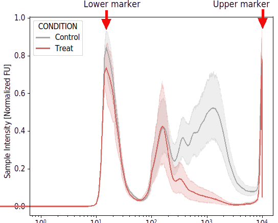
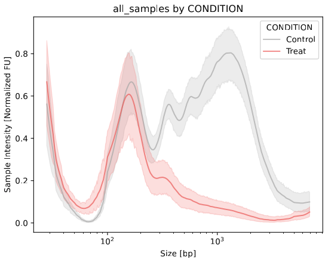
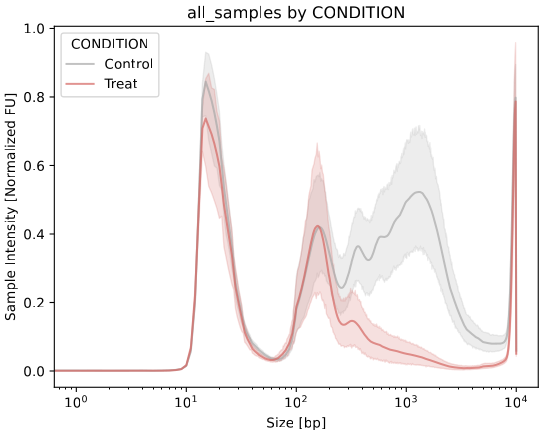

Ladders
===================

1. The DNAvi ladder file
^^^^^^^^^^^^^^^^^^

The ladder file is simply a translation of your marker bands to the associated base pair sizes.
It is a .csv file with only 3 columns:

.. list-table:: Example of a DNAvi ladder file
   :widths: 25 25 50
   :header-rows: 1

   * - Peak
     - Basepairs
     - Name
   * - 1
     - 10000
     - HSD5000
   * - 2
     - 5000
     - HSD5000
   * - ...
     - ...
     - ...

:download:`ladder file example <_static/ladder.csv>`

2. Handling marker bands
^^^^^^^^^^^^^^^^^^

2.1 What is a marker band?
""""""""""""""""""""""""""

For many electrophoresis systems, the ladder DNA contains an upper and/or lower DNA marker band for calibration.
However, the marker peak may not be of interest or even interfere with your analysis of cell-free DNA.
Therefore, DNAvi offers the option to **exclude** marker bands from the analysis.

2.2 How to exclude marker peaks
""""""""""""""""""""""""""

To exclude markers, change the peak name in the **ladder file** to a string containing the word **"marker"**:

.. list-table:: Example of a DNAvi ladder file (Markers will be excluded)
   :widths: 25 25 50
   :header-rows: 1

   * - Peak
     - Basepairs
     - Name
   * - **upper_marker**
     - 10000
     - HSD5000
   * - 2
     - 5000
     - HSD5000
   * - ...
     - ...
     - ...
   * - **lower_marker**
     - 15
     - HSD5000

DNAvi will now **exclude** the peaks at 10,000 and 15 base pairs from its analysis:

2.3 How to include marker peaks
""""""""""""""""""""""""""

You have two options. Either, you rename the markers so that the peak column does not contain the word **marker** anymore.
Alternatively, keep the file unchanged and run DNAvi with the **--include** argument

.. code-block::

   python3 DNAvi.py -i tests/electropherogram.csv -l tests/ladder.csv -m tests/metadata.csv **--include**

This will result in the markers being included, without the need to change the ladder file:

3. Handling multipe ladders (beta)
^^^^^^^^^^^^^^^^^^

