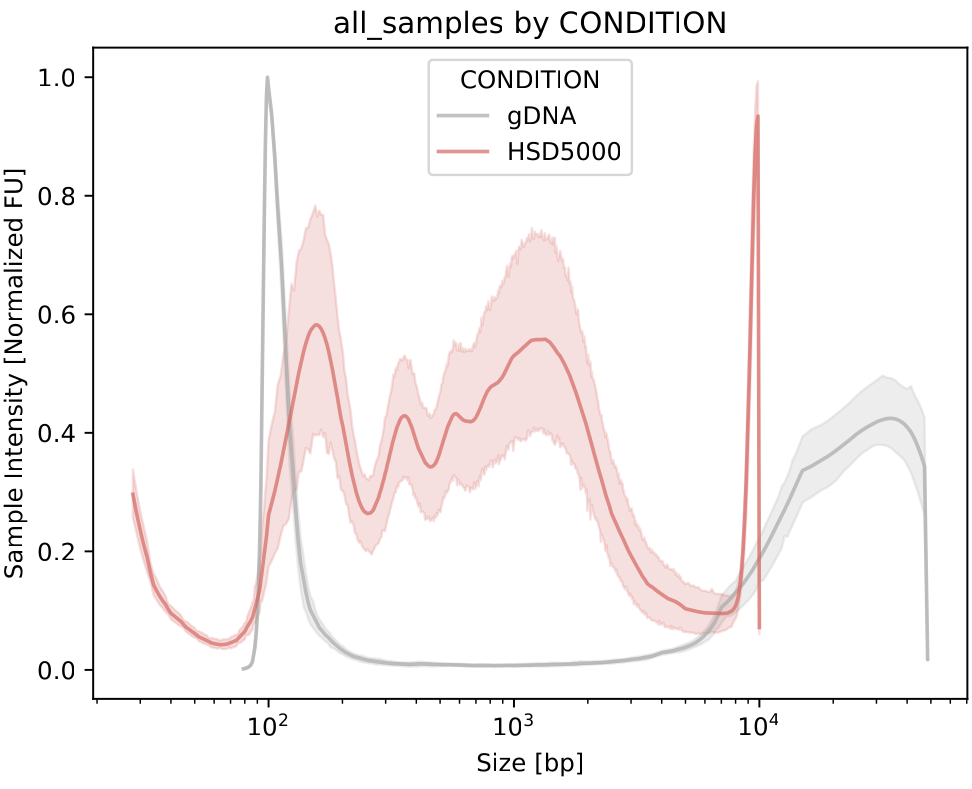

Ladders
===================

The DNAvi ladder file
^^^^^^^^^^^^^^^^^^

The ladder file is simply a translation of your marker bands to the associated base pair sizes.
It is a .csv file with only 3 columns:

Changing the position of the DNA ladder in the data
^^^^^^^^^^^^^^^^^^

If your input is a table, simply *rename* the column with the marker intensities to *Ladder*.
No matter where the column is, it will be used as the ladder by autodetection.

Alternatively, force to use a specific lane running DNAvi with *--marker_lane* or *-ml* tag.
This works for images as well.

.. code-block::

    python3 DNAvi.py -i electropherogram.csv -l ladder.csv -m meta.csv --marker_lane 3

E.g. with above code the 3rd lane/column will be used as DNA marker.

Handling marker bands
^^^^^^^^^^^^^^^^^^

What is a marker band?
""""""""""""""""""""""""""

For many electrophoresis systems, the ladder DNA contains an upper and/or lower DNA marker band for calibration.
However, the marker peak may not be of interest or even interfere with your analysis of cell-free DNA.
Therefore, DNAvi offers the option to **exclude** marker bands from the analysis.

.. image:: _static/example_marker.png
  :width: 400
  :alt: Marker

How to exclude marker peaks
""""""""""""""""""""""""""

To exclude markers, change the peak name in the **ladder file** to a string containing the word **"marker"**:

.. list-table:: Example of a DNAvi ladder file (Markers will be excluded)
   :widths: 25 25 50
   :header-rows: 1

   * - Peak
     - Basepairs
     - Name
   * - **upper_marker**
     - 10000
     - HSD5000
   * - 2
     - 5000
     - HSD5000
   * - ...
     - ...
     - ...
   * - **lower_marker**
     - 15
     - HSD5000

DNAvi will now **exclude** the peaks at 10,000 and 15 base pairs from its analysis:

.. image:: _static/example_nomarker.png
  :width: 400
  :alt: No marker

How to include marker peaks
""""""""""""""""""""""""""

You have two options. Either, you rename the markers so that the peak column does not contain the word **marker** anymore.
Alternatively, keep the file unchanged and run DNAvi with the **--include** argument

.. code-block::

   python3 DNAvi.py -i tests/electropherogram.csv -l tests/ladder.csv -m tests/metadata.csv **--include**

This will result in the markers being included, without the need to change the ladder file:

.. image:: _static/example_marker_unanno.png
  :width: 400
  :alt: No marker unanno

Handling multipe ladders (beta)
^^^^^^^^^^^^^^^^^^

You may choose to combine electropherogram signal tables that were run with **multiple (different)** ladders.
In this case, DNAvi offers an explorative feature to handle this:

Step 1: providing a multi-ladder ladder file.
""""""""""""""""""""""""""

Simply add the markers of the second ladder below the first ladder. Make sure the **Name** is changed accordingly.
The **order** of the ladders in this file will dictate their translation in the input signal table.

.. csv-table:: Example of a multi-ladder DNAvi ladder file
   :file: _static/ladder_multi.csv
   :widths: 30, 30, 30
   :header-rows: 1

:download:`example <_static/ladder.csv>`

Step 2: Combining input from electrophoresis with two different ladders
""""""""""""""""""""""""""

Next, you can create the input file by copy-pasting the second file (including the second ladder) to the first table,
resulting in something like this:

.. csv-table:: Example of a multi-ladder DNAvi ladder file
   :file: _static/table_input_multi.csv
   :widths: 30, 30, 30, 30, 30, 30
   :header-rows: 1

When we now run DNAvi, samples **1-6** will be size-annotated using the **HSD5000** ladder, samples **7-8** however
will be size-annotated with the **gDNA** ladder.

.. code-block::

    python3 DNAvi.py -i tests/electropherogram_multiladder.csv -l tests/ladder.csv -m tests/metadata.csv

... As you can see, the control group is annotated with the HSD5000 marker, the treat group with the high molecular weight
marker.