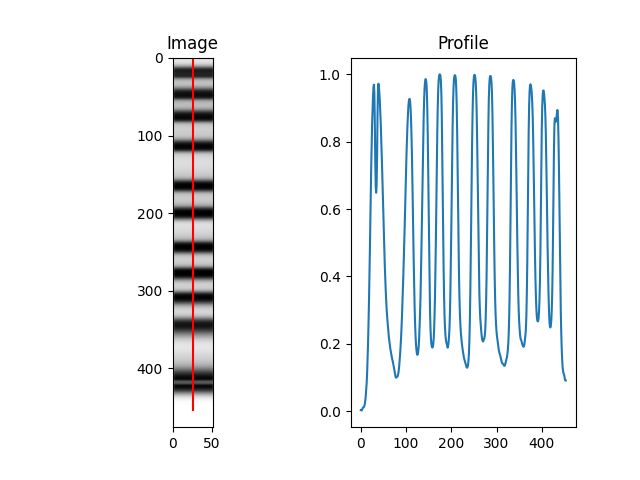

Ladders (DNA size standards)
===================

The DNAvi ladder file
^^^^^^^^^^^^^^^^^^

The ladder file is simply a translation of your marker bands to the associated base pair sizes.
It is a .csv file with 3 columns: **Peak, Basepairs, Name**

    .. csv-table:: Example of  ladder DNAvi ladder file
       :file: _static/ladder.csv
       :widths: 30, 30, 30
       :header-rows: 1

Each peak should be connected to a base pair value in **descending** order, as expected in a normal agarose gel.
The name, which you may choose, has to be the **same for all peaks of a ladder**.

My marker is not in the first lane - What can I do?
^^^^^^^^^^^^^^^^^^

If your input is a table, simply *rename* the column with the marker intensities to *Ladder*.
No matter where the column is, it will be used as the ladder by autodetection.

Alternatively, force to use a specific lane running DNAvi with *--marker_lane* or *-ml* tag.
This works for images as well.

.. code-block::

    dnavi -i electropherogram.csv -l ladder.csv -m meta.csv --marker_lane 3

E.g. with above code the 3rd lane/column will be used as DNA marker.

Ladder processing in DNAvi
^^^^^^^^^^^^^^^^^^

Overview
""""""""""""""""""""""""""

DNAvi utilizes SciPy's *find_peaks()* function to detect DNA size marker bands. You can directly evaluate the output of
this function in the ladder plot provided in the **QC folder.**

        .. image:: _static/peak_detected.png
          :width: 400
          :alt: Gel lanes

To manually adjust peak detection parameters, please refer to the :doc:`/Advanced`.
Based on the annotation file, DNAvi will assign actual base pair positions to the data:

        .. image:: _static/ladder_interpol.png
          :width: 400
          :alt: Gel lanes

Handling of missing or extra ladder peaks
""""""""""""""""""""""""""

If DNAvi detects *more* or *less* peaks in your image/signal table than expected from the ladder annotation file, it will
throw an error, and take a note in the log file.

This is how the error message looks like:

.. code-block::

    Inconsistent number of peaks between ladder file (10 bands) and the actual data in gel image/table ladder (11 bands).
    Please check /.../qc/ to see what peaks are missing or whether your ladder is in the wrong position or if this is NOT a gel image.

Curvature correction
""""""""""""""""""""""""""

In gel images, DNAvi does not perform an extra curvature correction for the lanes.
However, since only the center of the band is used to derive the marker profile, DNAvi's marker detection is likely robust to slight
angle deviations at the edge of the marker bands:

Handling marker bands
^^^^^^^^^^^^^^^^^^

What is a marker band?
""""""""""""""""""""""""""

For many electrophoresis systems, the ladder DNA contains an upper and/or lower DNA marker band for calibration.
However, the marker peak may not be of interest or even interfere with your analysis of cell-free DNA.
Therefore, DNAvi offers the option to **exclude** marker bands from the analysis.

.. image:: _static/example_marker.png
  :width: 400
  :alt: Marker

How to exclude marker peaks
""""""""""""""""""""""""""

To exclude markers, change the peak name in the **ladder file** to a string containing the word **"marker"**:

.. list-table:: Example of a DNAvi ladder file (Markers will be excluded)
   :widths: 25 25 50
   :header-rows: 1

   * - Peak
     - Basepairs
     - Name
   * - **upper_marker**
     - 10000
     - HSD5000
   * - 2
     - 5000
     - HSD5000
   * - ...
     - ...
     - ...
   * - **lower_marker**
     - 15
     - HSD5000

DNAvi will now **exclude** the peaks at 10,000 and 15 base pairs from its analysis with a certain safety-range
that will be automatically determined based on the first sample:

How to exclude markers for each sample individually
""""""""""""""""""""""""""

Usually, it is sufficient to estimate the lower and upper marker cropping
from the first sample. However, in some cases with very different DNA concentration (e.g., dilution series),
it may be desired to determine the border for each sample individually. To do so, simply run DNAvi adding the **- - correct**
parameter.

How to include marker peaks
""""""""""""""""""""""""""

You have two options. Either, you rename the markers so that the peak column does not contain the word **marker** anymore.
Alternatively, keep the file unchanged and run DNAvi with the **--include** argument

.. code-block::

   dnavi -i tests/electropherogram.csv -l tests/ladder.csv -m tests/metadata.csv --include

This will result in the markers being included, without the need to change the ladder file:

Handling multipe ladders (beta)
^^^^^^^^^^^^^^^^^^

You may choose to combine electropherogram signal tables that were run with **multiple (different)** ladders.
In this case, DNAvi offers an explorative feature to handle this:

Step 1: providing a multi-ladder ladder file.
""""""""""""""""""""""""""

Simply add the markers of the second ladder below the first ladder. Make sure the **Name** is changed accordingly.
The **order** of the ladders in this file will dictate their translation in the input signal table.

.. csv-table:: Example of a multi-ladder DNAvi ladder file
   :file: _static/ladder_multi.csv
   :widths: 30, 30, 30
   :header-rows: 1

:download:`example <_static/ladder.csv>`

Step 2: Combining input from electrophoresis with two different ladders
""""""""""""""""""""""""""

Next, you can create the input file by copy-pasting the second file (including the second ladder) to the first table,
resulting in something like this:

.. csv-table:: Example of a multi-ladder DNAvi ladder file
   :file: _static/table_input_multi.csv
   :widths: 30, 30, 30, 30, 30, 30
   :header-rows: 1

When we now run DNAvi, samples **1-6** will be size-annotated using the **HSD5000** ladder, samples **7-8** however
will be size-annotated with the **gDNA** ladder.

.. code-block::

    dnavi -i tests/electropherogram_multiladder.csv -l tests/ladder.csv -m tests/metadata.csv

.. image:: _static/example_multiladder.png
  :width: 400
  :alt: Multiladder

... As you can see, the control group is annotated with the HSD5000 marker, the treat group with the high molecular weight
marker.