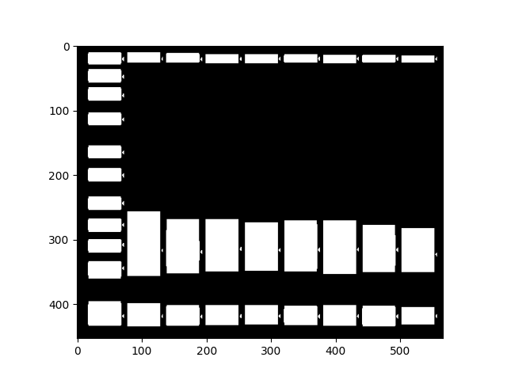
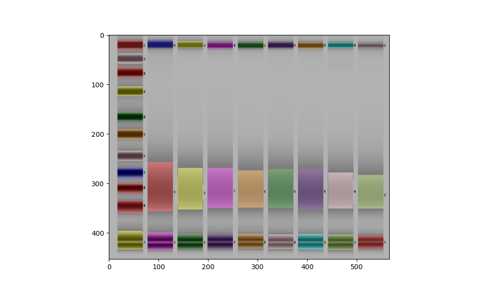
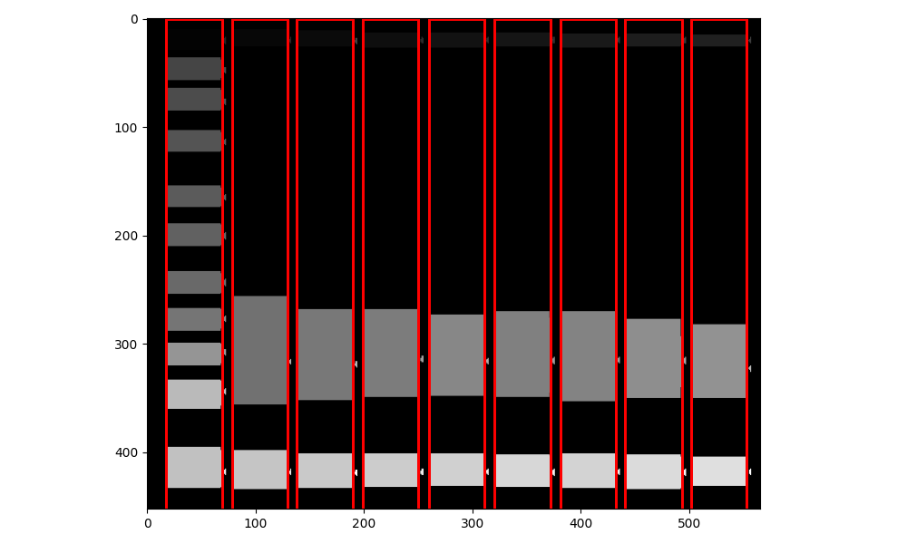
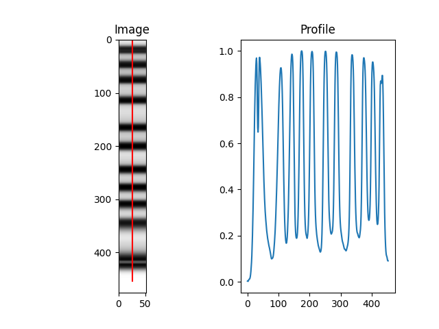
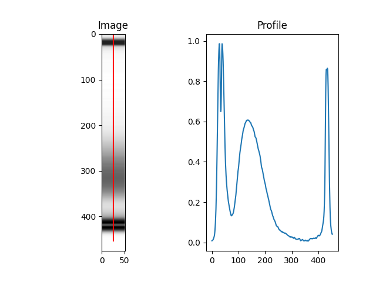

Outputs
===================

After your analysis has been performed, your data will be appear in the directory of the input file(s).

1. Output folder
^^^^^^

If you wish to specify your output folder's name you can do so with the **-n/--name** argument

.. code-block::

    python3 DNAvi.py -i /path/to/input/files -l ladder.csv -m meta.csv --name YOUR_NAME

The folder will contain the inputs you have submitted to DNAvi prior to the analysis.
The results folder contains two sub-directories, called QC and plots.

1.1 QC
""""""""""""""""""""""""""
The QC folder is all about the DNA marker and detecting its peaks. It makes sense to check it and make sure your DNA ladder has been recognized correctly, and that the base pairs assigned make sense. You will find the following files:
    • **info.csv** – a simple table giving information on your ladder type
    • **interpolated.csv** – your input data with missing intensity values interpolated
    • **bp_translation.csv** – your input, but instead of ladder intensity values now with the assigned base pair position.
    • **Peaks_LADDER-NAME.pdf** – A line plot that will show you the detected peaks as yellow crosses. Make sure all peaks that you consider important are correctly detected. The x-axis will only give you positional values at that stage.

        .. image:: _static/ladder_peaks.svg
          :width: 400
          :alt: Gel lanes

    • **Peaks_LADDER-NAME_interpolated.pdf** – Similar visualizations of ladder with base pairs already annotated.

        .. image:: _static/ladder_interpol.png
          :width: 400
          :alt: Gel lanes

    • **peaks_all_interpolated.pdf** – Similar visualization, **for multi-ladder input**

        .. image:: _static/ladder_all.png
          :width: 400
          :alt: Gel lanes

Once you have checked the QC outputs and found your ladder correctly annotated, you may proceed to the plots folder and check your samples.

1.2 Plots
""""""""""""""""""""""""""

The directory contains results in a long table format and visualization. The visualization provides line profiles of individual samples,
and additional plots if you specified categrories in the :doc:`/Metadata`.

    • **all_samples.pdf** – a grid plot showing each DNA sample as an individual line plot
    • **all_samples_summary.pdf** – a line plot summarizing all samples in a single plot (average)
    • **all_samples_by_YOURVARIABLE.pdf** –  a plot colored by group variable for each variable specified in the :doc:`/Metadata`
    • **sourcedata.csv** – underlying data table, helpful for loading into another program (R, pyhton, GraphPad) or source data sharing

A single sample example is provided below:

        .. image:: _static/example_sample.png
          :width: 400
          :alt: Single sample line plot

Continue to :doc:`/Visualization` for a detailed overview on the generated plots.

1.3 Stats
""""""""""""""""""""""""""

This folder contains the statistics including group metrics in case you provided :doc:`/Metadata`.
    • **basic_statistics.csv**
    • **peak_statistics.csv**
    • **group_statistics.csv**

Continue to :doc:`/Statistics` for a detailed overview on the statistics.

2. Gel image outputs
^^^^^^^^^^^^^^^^^^^^^^^^^^^^^^^^^^^^^^^^^

In case you have uploaded a gel image a third folder called **images** will provide outputs from the image analysis. This is particularly helpful for
troubleshooting. It's recommended to carefully check these outputs to understand if all DNA lanes have been successfully recognized.

2.1 Thresholding
""""""""""""""""""""""""""

**gel_thresholded.png** is the first intermediate output showing the result of DNAvi's thresholding. In white are all objects recognized on the image.

2.2 Object detection
""""""""""""""""""""""""""

**gel_lanes.png** should look like below example. Every band that is recognized will be marked by a colored overlay.

2.3 Lane border inference
""""""""""""""""""""""""""
**gel_lanes_border.png** should look like below example. Every band that is recognized will be marked by a colored overlay.

2.4 Individual DNA profiles
""""""""""""""""""""""""""
Each lane detected will be sliced and annotated. Below how this would look like for a ladder lane:

... or a normal sample lane:

Please carefully check our :doc:`/Inputs` section on image inputs to assure your image is in compliance with the image quality requirements.

