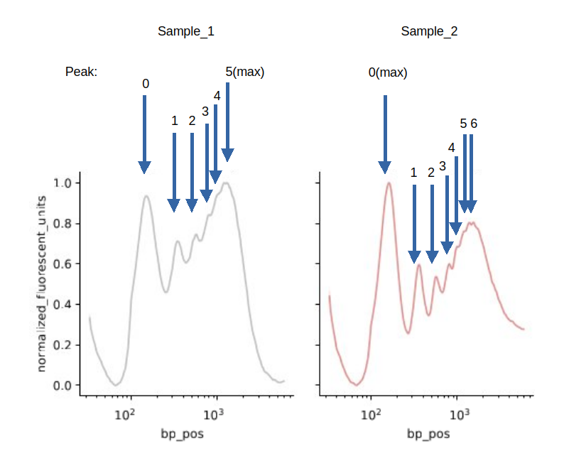
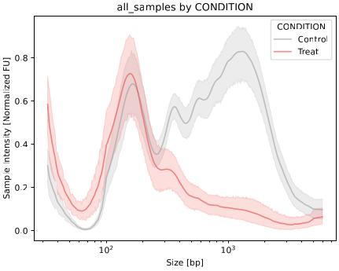

Statistics
===================

This section describes DNAvi's statistical analyses and outputs.

Basic statistics
^^^^^^^^^^^^^^^^^^

This table is a broad description of your dataset, specifically all numerical data provided.

.. csv-table:: Example of basic statistics output
   :file: _static/basic_statistics.csv
   :widths: 30, 30, 30, 30
   :header-rows: 1

The following metrics are provided and examplified based on the "bp_pos" column:
    • **count** - number of table entries (e.g. 13,230 possible basepair positions)
    • **mean** - data mean (e.g. average size of all samples is 1353.6 bp, and average age is 35.4 years)
    • **std** - standard deviation (e.g. +- 1391.7 bp and +- 29.5 years)
    • **min, max** - minimum and maximum (33 and 5897 bp - depends on whether markers are included or excluded)
    • **25%, 50%, 75%** - percentiles

Peak statistics
^^^^^^^^^^^^^^^^^^

This table contains information on average sizes and individual peaks. Let's have a look at the line plots for two samples to understand the corresponding statistics:

.. csv-table:: Example of peak statistics output
   :file: _static/peak_statistics.csv
   :widths: 30, 30, 30, 30, 30, 30
   :header-rows: 1

For each sample, peak metrics are provided:
    • **average_size** : the average fragment size, estimated from the signal table (histogram)
    • **max_peak**: the most intense peak (peak with highest fluorescent signal) of this sample
    • **metadata**: additional columns assigning categories if :doc:`/Metadata` were provided
    • **peak_id**: the detected peaks (0-based) for each sample, numbered from low to high fragment size, and their metrics. In the example, 6 peaks are detected in Sample_1 while 7 peaks detected in Sample_2.

Group statistics
^^^^^^^^^^^^^^^^^^

For each variable specified in the :doc:`/Metadata` a table containing statistical testing results is provided.
Let's have a look at an example where cell-free DNA from two groups (Control vs. Treatment) were compared.
The metadata-based evaluation allows to answer biological questions (see also next section).

.. csv-table:: Example of group statistics output I
   :file: _static/group_statistics_by_CONDITION.csv
   :widths: 30, 30, 30, 30, 30, 30, 30
   :header-rows: 1

**Result:** In this example, the **average_size**, **max_peak**, and also the **first peak** size do show a statistical difference
between the two groups, as the Kruskal Wallis test computed a *p* value **< 0.05**. **Unique peaks** refer to peaks that only occur in one group,
but not in the other. Because they are unique to a group, no statistical comparison is performed for those peaks.
