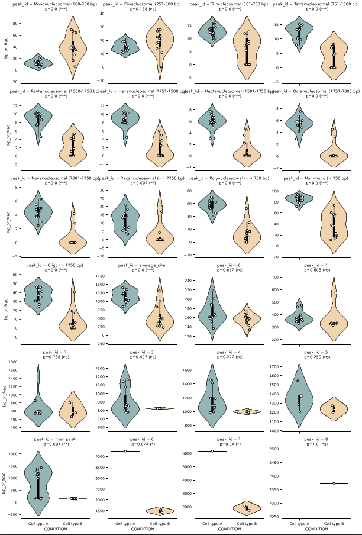
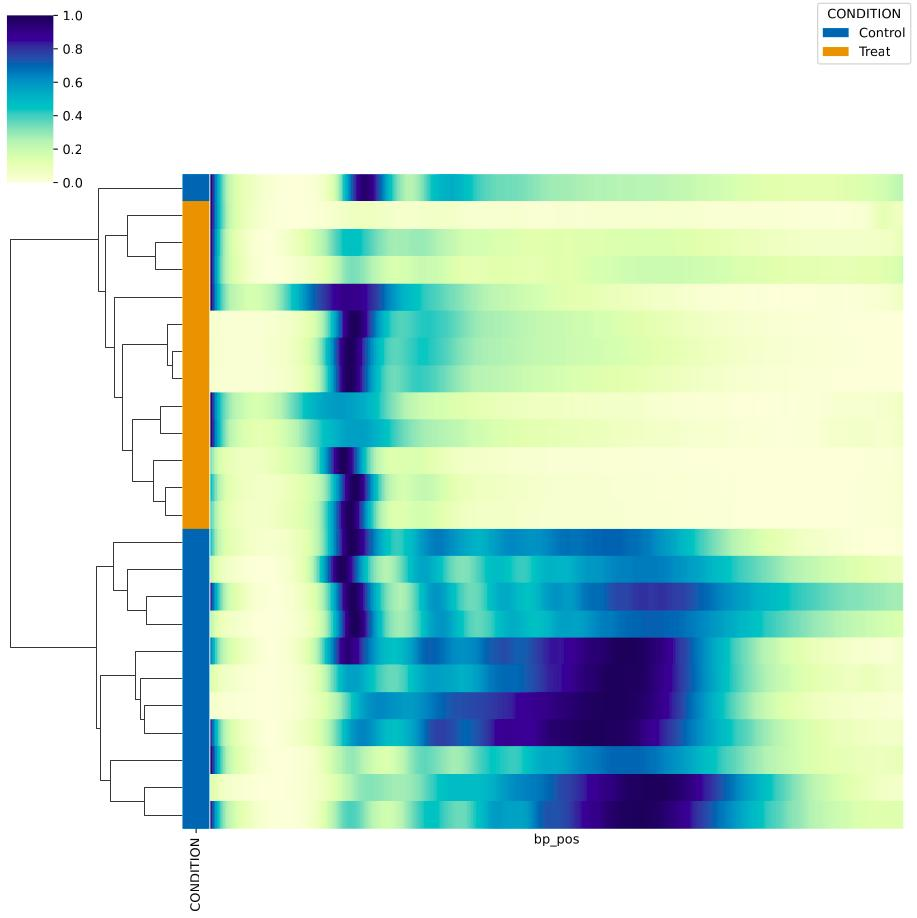

Visualization
===================

Below we will discuss DNAvi's visualization outputs and options.

Sample line plots
""""""""""""""""""""""""""

            .. image:: _static/example_sample.png
                :width: 300
                :alt: Single sample line plot

The y-axis shows normalized fluoresence signals to fit a value between 0 and 1. This way fragment
profiles become comparable irrespective of sample concentration. The x-axis shows the basepair
position based on the values submitted for your ladder. This is displayed in log scale. Each subplot
is titled by the sample name you specified either in the table or meta file.

Sample grid plots
""""""""""""""""""""""""""

If multiple samples are present, a grid plot showing each DNA sample as an individual line plot is provided:

Sample average plot
""""""""""""""""""""""""""

If no grouping information is provided, the profiles of all samples are averaged into a single plot.

            .. image:: _static/example_all_samples.png
                :width: 400
                :alt: All sample av line plot

Annotated basepair peak plots
""""""""""""""""""""""""""
Line plots for each sample with the detected peaks and the annotated size in base pairs are in the **stats folder**

            .. image:: _static/example_stats_anno.png
                :width: 400
                :alt: stats

Grouped plots
""""""""""""""""""""""""""

Grouped line plot
^^^^^^^^^^^^^^^^^^

This visualization is generated for each colummn (variable) specified in the :doc:`/Metadata`.
Each groups' sample line profiles will be averaged and displayed in an individual color.

            .. image:: _static/example_nomarker.png
                :width: 400
                :alt: Single sample line plot

Grouped violin plot
^^^^^^^^^^^^^^^^^^

Violin plots for average peak sizes and nucleosomal fractions including statistics (**p value / significance stars**) are provided as well in the **stats folder**

Clustermap
""""""""""""""""""""""""""

Clustering of samples by similarity, an additional column for each variable specified in the :doc:`/Metadata`.

