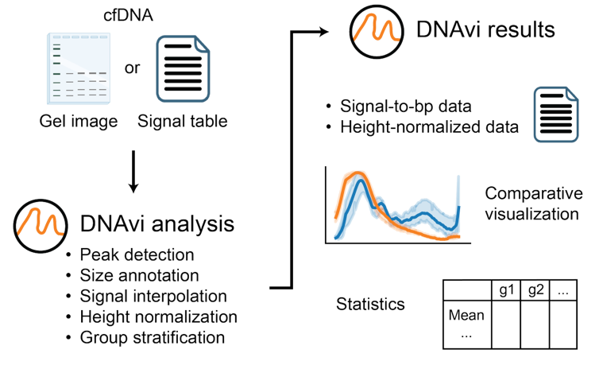
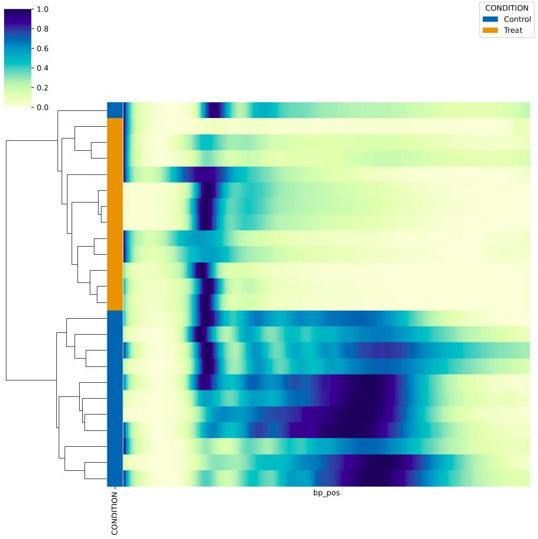
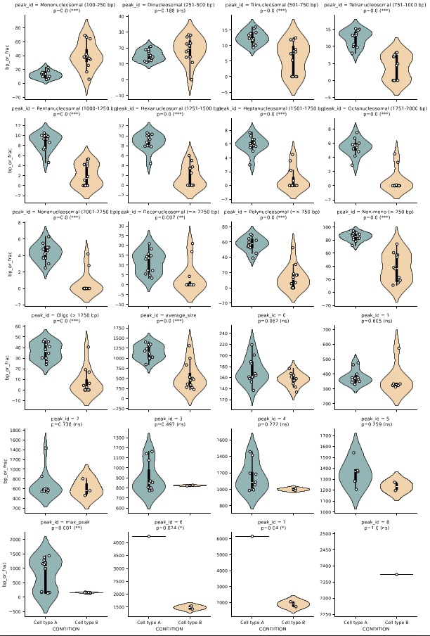

.. DNAvi documentation master file, created by
   sphinx-quickstart on Thu Jul 24 15:51:52 2025.
   You can adapt this file completely to your liking, but it should at least
   contain the root `toctree` directive.

DNAvi -  Integration, statistics and visualization of cfDNA fragment traces
===================

DNAvi is a Python-based tool for rapid analysis and visualization of cell-free DNA (cfDNA) fragment size profiles directly from electrophoresis data, without the need for sequencing. It enables normalization, statistical comparison, and publication-ready plotting of multiple samples, supporting quality control and exploratory fragmentomics in clinical and research workflows.

.. toctree::
   Installation
   Quickstart
   Inputs
   Ladders
   Metadata
   Outputs
   Visualization
   Statistics
   Biology
   Advanced
   :maxdepth: 1
   :caption: Contents

Workflow
^^^^^^^^^^^^^^^^^^

Quickstart
^^^^^^^^^^^^^^^^^^

.. code-block::

    python3 DNAvi.py -i tests/electropherogram.csv -l tests/ladder.csv -m tests/metadata.csv

Example output
^^^^^^^^^^^^^^^^^^

Cell-free DNA electropherogram similarity clustering with group annotation

Violin plots for average nucleosomal fractions including statistics

Citation
^^^^^^^^^^^^^^^^^^
**Anja Hess, Dominik Seelow, and Helene Kretzmer: DNAvi:  Integration, statistics and visualization of cfDNA fragment traces (2025).**

